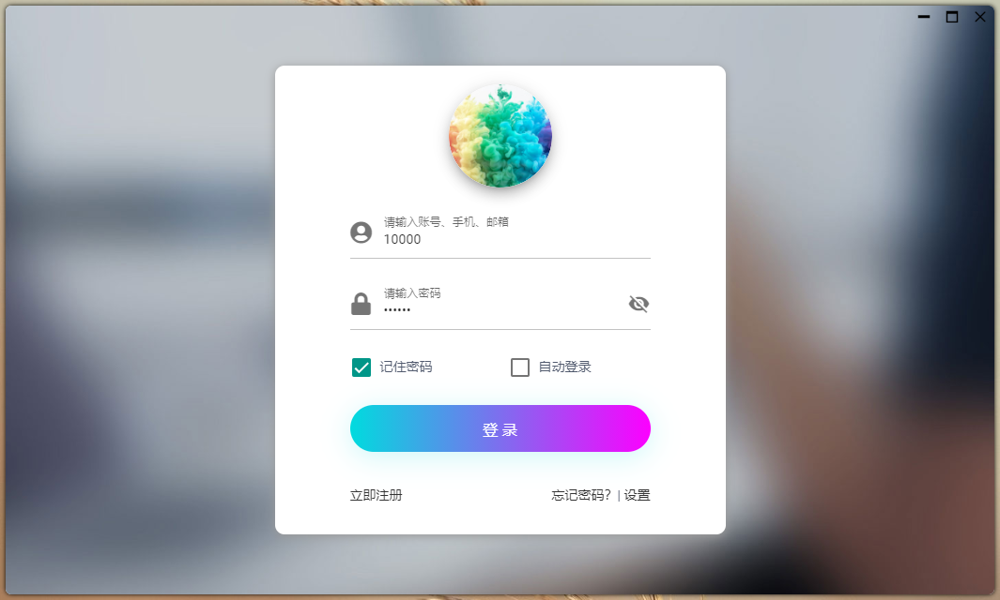
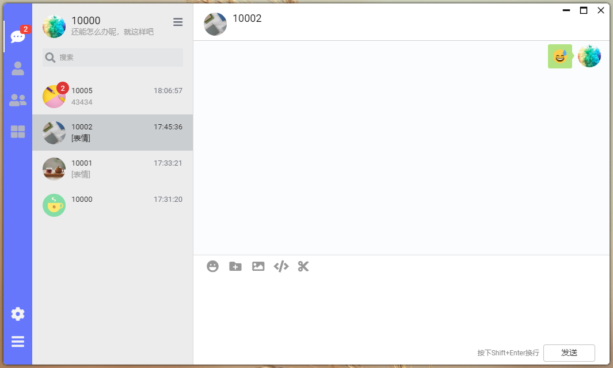
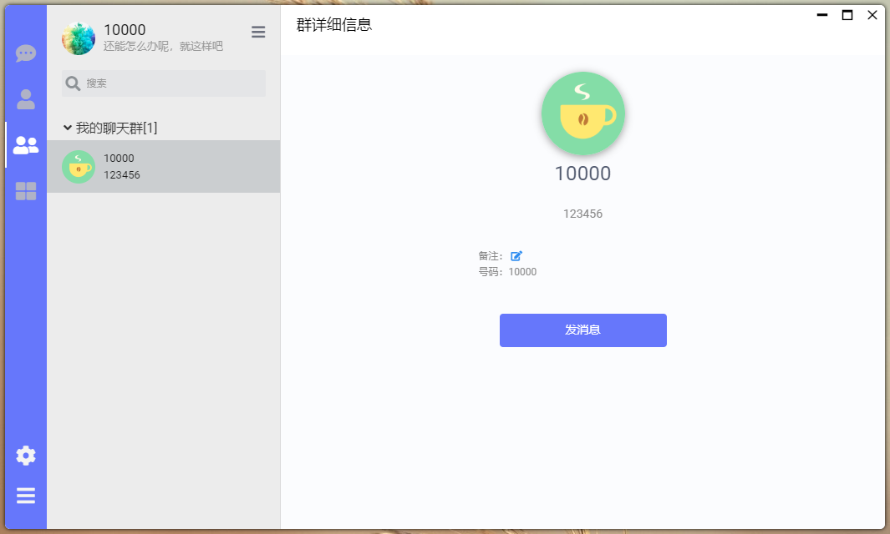
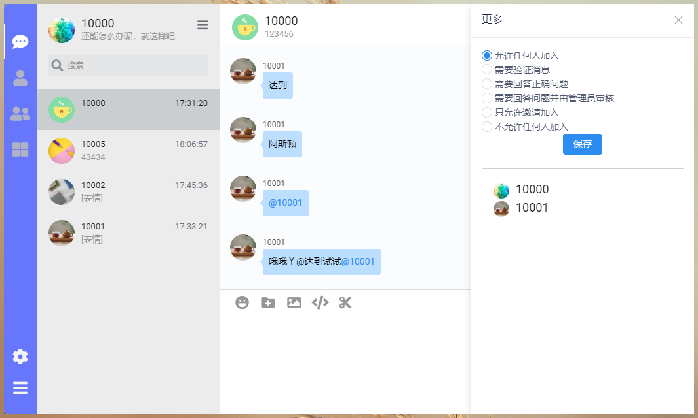
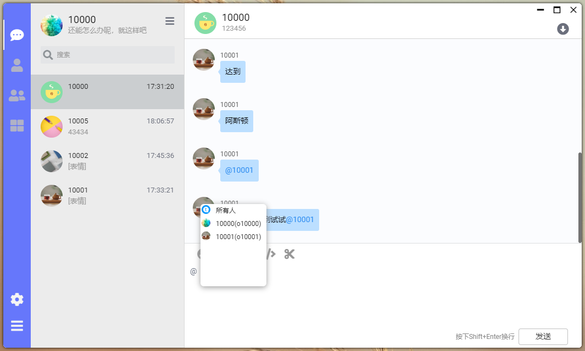

## oim-server

## OIM即时通讯方案

OIM目前已经含服务端、PC、移动端即时通讯解决方案，主要包含以下内容。

| 仓库                                                    | 说明                                                     | 备注 |
| -------------------------------------------------------| ------------------------------------------------------- | ---- |
| [oim-server](https://gitee.com/oimchat/oim-server)     | OIM服务端源码仓库                                          |含Spring Cloud 微服务和单机版，添加服务即可添加加功能|
| [oim-fx](https://gitee.com/oimchat/oim-fx)             | 基于[JavaFX] 实现的桌面客户端 支持 Windows、Mac、Linux        |      |
| [oim-e](https://gitee.com/oimchat/oim-e)               | 基于[Electron]实现的桌面客户端 支持 Windows、Mac、Linux       |      |
| [oim-web](https://gitee.com/oimchat/oim-web)           | Web平台的Demo, [体验地址](http://web.wildfirechat.net)      |      |
| [oim-m](https://gitee.com/oimchat/oim-m)               | Vue 实现的移动客户端 可以通过cordova 打包成安卓和IOS客户端       |      |


### OIM服务端简介
不要被客户端迷惑了，真正值钱的是服务端😂，
OIM服务是采用Java语言开发，基于spring cloud微服务体系开发的一套即时通讯服务端。
从单机到微服务都提供了可部署方案，并且单机、微服务都可以平滑切换，客户端可以毫无感知服务变更

### 特点
oim-server 可以让你像spring mvc一样开发即时通讯接口，对于有web后台开发经验，没用即时通讯服务端经验开发者，可以
轻松转换，并且兼容spring web接口。如下示例

```
请求接口
@RestController
public class UserController {

	/**
	 * 
	 * 登录<br>
	 * Date 2019-02-17 12:26:38<br>
	 * 
	 * @param user
	 * @since 1.0.0
	 */
	@ActionMapping(value = "/user/login") // 此路同样可以用http post请求
	public User login(
			@Define("body.user") User user) { // "body.user"(此body是json内的body字段，不是http协议的body) 
			                                  // 是http或者tcp中的消息体json属性路径{"body":{"user":{}}}
		// ...省略实现内容
		return user;
	}
}
```

### 目录说明
```
|__oim-server-run # Java服务
    |__cloud #微服务运行版
        |__common #公共依赖的jar
            |__oim-server-element-basic-* #这些是单机和微服务都依赖部分，含一些抽象定义，微服务和单机有不同实现
            |__oim-server-element-cloud-* #这些是微服务所需的依赖，针对微服务的一些实现
        |__service #每个运行的微服务
            |__core #主要是技术管理类型微服务 如：注册中心、网关等
                |__action #收集所有服务的接口地址，这样网关可以无需配置服务名，直接通过接口地址访问到对应的服务
                |__admin #只是集成了spring boot admin
                |__center #注册中心
                |__gateway #网关
            |__net #即时通讯的TCP、WebSocket等长连接服务
                |__control 用于管理（net-work）用户客户端长连接服务
                |__work 用户客户端长连接服务
            |__support #公共支持服务 如：文件上传
                |__file
            |__system #针对整个系统的配置、共数据等
                |__setting #
            |__work #业务服务（因为business太长了，还有其他地方容易用到这个名字）
                |__chat #聊天业务
                |__contact #联系人
                |__core #核心：用户
                |__group #群
                |__portal #服务地址入口
    |__single #单机版
        |__oim-server-single-main # 因为单机和微服务的功能模块是共用的，这里是针对一些抽象的单机实现
        |__oim-server-single-running #启动服务配置
|__oim-server-web # Vue 后台管理界面


```

### 微服务版架构图
https://www.processon.com/view/link/5f6c4ae11e08531ce9d4cf16
里面有简单描述服务之间关系和启动步骤

### OIM依赖说明
首先说明，oim-server中不管是个人封装框架还是第三方框架，均为开源框架。其中aware-xxx和wofa-server-xxx、only-xxx都是个人所封装的
框架或者技术工具，部分已经发布maven中央库。
oim-server最初业务代码和网络框架有一定的耦合，后面oim的目标是能做成既能现成使用，又能成为框架，并且尽量不要限制技术框架
所有oim-server拆分成了多个模块。
其中wofa-server-xxx是我对即时通讯的封装，也是它能实现如mvc一般写接口，下面具体说明

```
依赖相关的代码库地址
https://gitee.com/onlylibrary
https://gitee.com/onlyaware
```

### OIM开发说明
```
1、环境要求：
JDK 1.8.0_xxx
DB 支持MySQL Oracle SQL server  推荐MySQL 8.0

微服务还需以下：
Redis 
RabbitMQ

2、关于微服务版和单机版使用
 微服务版的业务代码和单机版业务代码是共用的，所以业务模块均在微服务目录下。只是在IM长连接等处理上有区别，所以单机和微服务需要不同处理的
 地方抽象成接口，在不同启动服务中各自实现
 
3、关于部分依赖下载不下来
    因为部分依赖尚未发布到maven中央库，而是在我的私库中，所以maven全局配置文件（通常在用户目录下.m2/setting.xml）中不能配置
 镜像服务（<mirrors></mirrors>中部分注释或者删掉）
 私库maven配置项目中已经配置
 
4、关于数据库脚本
    只要先创建好数据库，修改数据库配置、启动自动创建表。目前默认H2数据库创建表有问题，推荐使用MySQL 8.0

```

### 关于wofa
在开源项目或者市面上，所发现的即时通讯开源项目多半是要么自定义协议，要么是XMPP。XMPP基于xml现在用起来可以说
有点难用了。其他私有协议多半是json格式，oim也是json格式。不过基本上原理是通过一个字段作为如cmd,分别 1、2、3、4
来表示什么接口。写的一般的通过if else执行不同方法，有些封装的好些的用了策略模式等。这些消息格式是挺简单的，
通俗易懂。简单功能开发也很快。但接口越来越多，功能越来越复杂。未必好维护、好扩展。
wofa参考了spring mvc 将tcp消息采用类似spring mvc的方式处理。本质上虽然和上述cmd 1、2、3没啥区别，但是wofa给了默认实现也给了自由扩展
不管是不是既采用oim的消息格式或者自定义都可以实现。作为程序开发，消息格式简单是挺好，也不怕复杂，就怕没规律。
源码地址：https://gitee.com/onlyaware


## 客户端截图

### oim-e











### oim-fx


